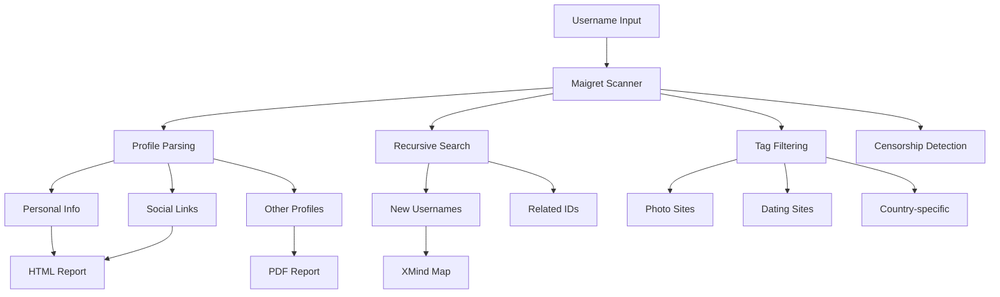

+++
date = '2025-09-26T20:58:21+10:00'
draft = false
title = 'Maigret - OSINT Username Investigation'
+++

# Maigret 🕵️


*The Commissioner Jules Maigret is a fictional French police detective, created by Georges Simenon. His investigation method is based on understanding the personality of different people and their interactions.*


**👉👉👉 [Online Telegram Bot](https://t.me/osint_maigret_bot)**

## About

**Maigret** collects a dossier on a person **by username only**, checking for accounts on a huge number of sites and gathering all the available information from web pages. No API keys are required. Maigret is an easy-to-use and powerful fork of [Sherlock](https://github.com/sherlock-project/sherlock).

Currently supports more than **3000 sites** ([full list](/docs/sites)), search is launched against 500 popular sites in descending order of popularity by default. Also supported checking Tor sites, I2P sites, and domains (via DNS resolving).

## 🚀 Main Features



- **Profile page parsing** - [Extraction](https://github.com/soxoj/socid_extractor) of personal info, links to other profiles, etc.
- **Recursive search** - Search by new usernames and other IDs found
- **Search by tags** - Site categories, countries (photo, dating, us, etc.)
- **Censorship and captcha detection** - Automatic handling of blocks
- **Requests retries** - Robust error handling

## 📦 Installation

### Windows
Standalone EXE-binaries for Windows are located in [Releases section](https://github.com/soxoj/maigret/releases).

### Cloud Shells
[](https://console.cloud.google.com/cloudshell/open?git_repo=https://github.com/soxoj/maigret&tutorial=README.md)

### Local Installation

```bash
# Install from PyPI (Python 3.11 recommended)
pip3 install maigret

# Usage
maigret username
```

### Docker

```bash
# Official image
docker pull soxoj/maigret

# Usage with volume mount
docker run -v /mydir:/app/reports soxoj/maigret:latest username --html
```

## 🔍 Usage Examples

```bash
# Basic search
maigret johndoe

# Generate HTML report
maigret johndoe --html

# Generate PDF report
maigret johndoe --pdf

# Search with tags (photo & dating sites)
maigret johndoe --tags photo,dating

# Search US sites only
maigret johndoe --tags us

# Search multiple usernames on all sites
maigret user1 user2 user3 -a
```

## 🌐 Web Interface

Run Maigret with a web interface for interactive results:

```bash
# Start web interface
maigret --web 5000

# Open http://127.0.0.1:5000 in browser
```

The web interface provides:
- Interactive search form
- Real-time results graph
- Downloadable reports (HTML, PDF, XMind)
- Account details table

## 📊 Powered By Maigret

Professional tools that use Maigret:
- [Social Links API](https://github.com/SocialLinks-IO/sociallinks-api)
- [Social Links Crimewall](https://sociallinks.io/products/sl-crimewall)
- [UserSearch](https://usersearch.ai/)

## 🎯 SOWEL Classification

This tool uses these OSINT techniques:
- **SOTL-2.2** - Search For Accounts On Other Platforms
- **SOTL-6.1** - Check Logins Reuse To Find Another Account
- **SOTL-6.2** - Check Nicknames Reuse To Find Another Account

## ⚖️ Disclaimer


**This tool is intended for educational and lawful purposes only.** The developers do not endorse or encourage any illegal activities or misuse of this tool.

Regulations regarding personal data collection vary by country and region (GDPR, CCPA, etc.). It is your responsibility to ensure compliance with applicable laws.


## 📚 Resources

- [GitHub Repository](https://github.com/soxoj/maigret)
- [Supported Sites List](/docs/sites)
- [Installation Guide](/docs/installation)
- [Usage Documentation](/docs/usage)
- [Changelog](/docs/changelog)
- [Contributing Guide](/docs/contributing)
- [Online Telegram Bot](https://t.me/osint_maigret_bot)

## 📈 Example Results

Check out these sample reports:
- [PDF Report](https://raw.githubusercontent.com/soxoj/maigret/main/static/report_alexaimephotographycars.pdf)
- [HTML Report](https://htmlpreview.github.io/?https://raw.githubusercontent.com/soxoj/maigret/main/static/report_alexaimephotographycars.html)
- [XMind 8 Report](https://raw.githubusercontent.com/soxoj/maigret/main/static/report_alexaimephotography_xmind_screenshot.png)
