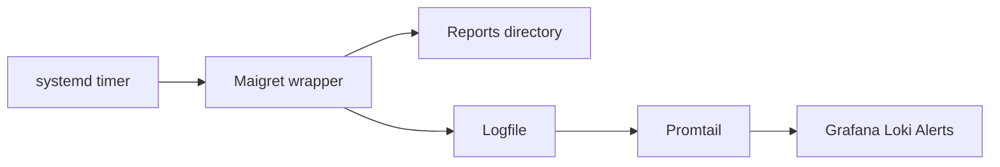

+++
title = "Schedule Maigret Jobs Without Surprises"
description = "Create resilient cron or systemd timers for recurring Maigret OSINT sweeps."
draft = false
+++

<script type="application/ld+json">
{
  "@context": "https://schema.org",
  "@type": "FAQPage",
  "mainEntity": [{
    "@type": "Question",
    "@id": "https://maigret.dev/faq/automate-maigret-cron",
    "name": "How can I automate Maigret with cron safely?",
    "acceptedAnswer": {
      "@type": "Answer",
      "text": "Wrap maigret in a script that exports proxy settings, rotates username inputs, logs JSON reports, and run it from cron or systemd with retry logic and rate-limit friendly settings."
    }
  }]
}
</script>

Automation keeps identity sweeps current, but needs guardrails to avoid hammering sites or leaking data.

## Wrapper script

```bash
#!/usr/bin/env bash
set -euo pipefail

export ALL_PROXY="socks5://127.0.0.1:9050"
STAMP="$(date +%F)"
INPUT="/opt/maigret/usernames.txt"
OUT="/var/reports/maigret"
LOG="/var/log/maigret-${STAMP}.log"

maigret --input "$INPUT" \
  --html --json --folderoutput \
  --output "$OUT" \
  --timeout 45 --max-connections 30 \
  --print-not-found false \
  >>"$LOG" 2>&1
```

## Cron entry

```bash
0 1 * * 1 torsocks /opt/maigret/run-maigret.sh
```

## systemd timer (alternative)

```ini
# /etc/systemd/system/maigret.service
[Service]
Type=oneshot
ExecStart=/opt/maigret/run-maigret.sh
```

```ini
# /etc/systemd/system/maigret.timer
[Timer]
OnCalendar=Mon *-*-* 01:00:00
Persistent=true
```

```bash
sudo systemctl enable --now maigret.timer
```

## Monitoring checklist
- Tail `journalctl -u maigret.service` for failures.
- Set up logrotate for `/var/log/maigret-*.log`.
- Run `maigret --self-check` weekly to disable broken sites.
- Use `flock` to prevent overlapping executions.

## Alerting idea



By combining torified networking, log rotation, and service timers you avoid both detection risks and redundant scans.
