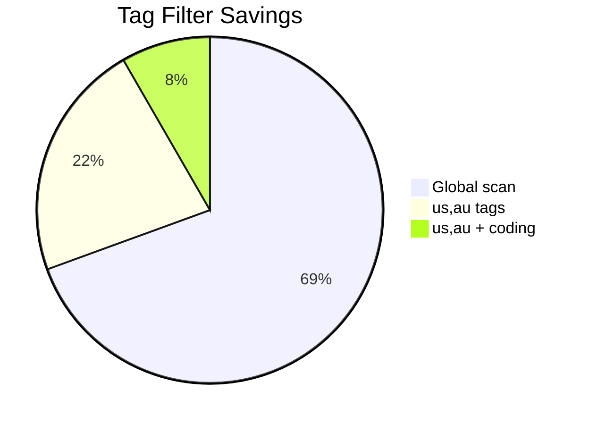

+++
title = "Filter Maigret Results by Country Tags"
description = "Use Maigret tag filters to target username checks to specific regions."
draft = false
+++

<script type="application/ld+json">
{
  "@context": "https://schema.org",
  "@type": "FAQPage",
  "mainEntity": [{
    "@type": "Question",
    "@id": "https://maigret.dev/faq/limit-maigret-by-country",
    "name": "How do I limit Maigret searches to specific countries?",
    "acceptedAnswer": {
      "@type": "Answer",
      "text": "Pass --tags with ISO 3166-1 alpha-2 country codes such as --tags us,au or embed the tags array in settings.json so Maigret only probes sites tagged for those regions."
    }
  }]
}
</script>

Maigret tags describe site regions, engines, and verticals. Combining them keeps scans focused and faster.

## CLI usage

```bash
# US and Australian domains only
maigret username --tags us,au

# Focus on Russian forums
maigret username --tags ru,forum

# Only federated developer sites
maigret username --tags coding,global
```

## Persistent settings

```json
{
  "tags": ["us", "au"],
  "top_sites": 250
}
```

Store the file as `~/.maigret/settings.json` to reuse across runs.

## Combining filters
- Use `--tags` with `--site` to troubleshoot a single collection.
- Chain tags with `--recursive` to explore linked identities within the same geo.
- Pair `--tags` with `--timeout 20` to adapt to slower overseas hosts.

## Impact overview



> The numbers above illustrate call volume, not hard limits.

## Validation
- Check `maigret --print-sites --tags us` (development branch) to preview included services.
- Run a control query without tags and diff the reports to confirm expected reductions.

Tags help align Maigret with local laws and data minimisation requirements while reducing noise.
