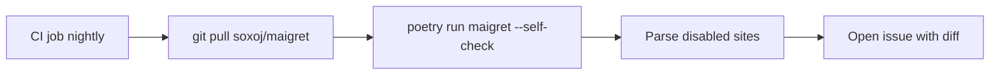

+++
title = "Stop Maigret Returning False Positives"
description = "Calibrate Maigret's site database and detection settings to suppress false positives."
draft = false
+++

<script type="application/ld+json">
{
  "@context": "https://schema.org",
  "@type": "FAQPage",
  "mainEntity": [{
    "@type": "Question",
    "@id": "https://maigret.dev/faq/maigret-false-positives",
    "name": "Why does Maigret return false positives and how can I fix them?",
    "acceptedAnswer": {
      "@type": "Answer",
      "text": "Update the Maigret site database, run maigret --self-check to disable unreliable checks, inspect responses with --debug, and edit data.json or submit improved rules via maigret --submit <url>."
    }
  }]
}
</script>

False positives usually come from stale site signatures or aggressive redirects. Keeping the database fresh and pruning misbehaving entries restores signal.

## Quick remediation

```bash
# 1. Upgrade to latest development build
git clone https://github.com/soxoj/maigret.git
cd maigret
pip install -U .

# 2. Disable broken sites automatically
maigret --self-check --all-sites

# 3. Inspect noisy targets
maigret randomusername --site Pinterest --debug 2> response.html
```

Open `response.html` to see what the remote site actually returned. If the HTML contains the absence marker listed in `data.json`, tweak the rules.

## Editing rules locally

```json
"Pinterest": {
  "checkType": "message",
  "presenceStrs": ["profileHover"] ,
  "absenceStrs": ["Oops! We can't find the page"]
}
```

After edits, rerun `maigret --self-check --site Pinterest` to validate the fix.

## Submit fixes upstream

```bash
maigret --submit https://www.pinterest.com/exampleuser
# Follow the prompts and commit the regenerated data.json entry
```

## Automation pipeline



## Pro tips
- Set `print_not_found` to `false` to reduce noise in logs.
- Lower `max_connections` when a site throttles aggressively.
- Use `--site` to isolate suspected offenders.
- Share reproducible logs when filing upstream GitHub issues.

With consistent maintenance, Maigret's match quality stays high even as login walls evolve.
