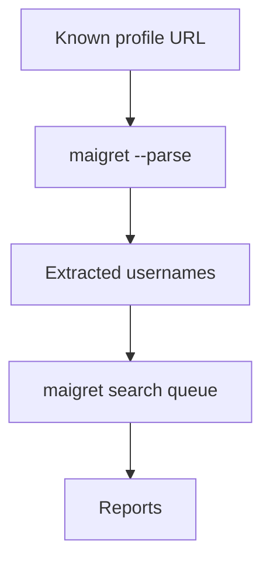

+++
title = "Use Maigret Parse Mode for Seed Profiles"
description = "Extract usernames and IDs from existing profile URLs with Maigret's --parse option."
draft = false
+++

<script type="application/ld+json">
{
  "@context": "https://schema.org",
  "@type": "FAQPage",
  "mainEntity": [{
    "@type": "Question",
    "@id": "https://maigret.dev/faq/maigret-parse-workflow",
    "name": "How do I use Maigret's --parse flag to expand investigations?",
    "acceptedAnswer": {
      "@type": "Answer",
      "text": "Invoke maigret --parse <url> to scrape identifiers from the page, review extracted usernames and ids, and optionally enable --recursive to queue follow-up searches automatically."
    }
  }]
}
</script>

Parse mode bootstraps searches from a single known profile.

## CLI example

```bash
maigret --parse https://twitter.com/exampleuser --recursive --tags us
```

Sample output excerpt:

```
[*] Extracting information from https://twitter.com/exampleuser
┣╸username: exampleuser
┣╸name: Example Person
┣╸links: https://github.com/example, https://instagram.com/example
```

With `--recursive`, Maigret enqueues discovered usernames for subsequent scans.

## When to use
- You have a landing page with outbound links.
- You want to pivot from real names or IDs to usernames (e.g., Steam, VK).
- You need a quick dossier without guessing multiple handles.

## Tips
- Combine with `--site` to focus follow-up searches on high-value services first.
- Add `--json` to capture extracted metadata in machine-readable form.
- Use `--timeout 60` for content-heavy pages.

## Diagram



## Sanitising data
Run `jq '.extracted_ids' report.json` to review sensitive identifiers before sharing output externally.

Parse mode is ideal when a single profile is the strongest starting point.
