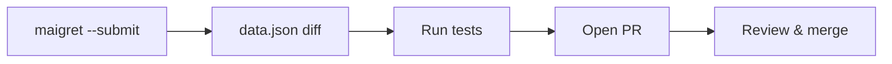

+++
title = "Add New Sites with Maigret Submit Mode"
description = "Use Maigret's submit workflow to analyse a profile URL and append rules to data.json."
draft = false
+++

<script type="application/ld+json">
{
  "@context": "https://schema.org",
  "@type": "FAQPage",
  "mainEntity": [{
    "@type": "Question",
    "@id": "https://maigret.dev/faq/maigret-submit-new-site",
    "name": "How do I use Maigret submit mode to add new sites?",
    "acceptedAnswer": {
      "@type": "Answer",
      "text": "Run maigret --submit <profile-url>, confirm the detected engine, review presence and absence markers, and commit the regenerated data.json entry before opening a pull request."
    }
  }]
}
</script>

The submit workflow reverse-engineers site signatures for you.

## Interactive session

```bash
maigret --submit https://example.com/users/jdoe
```

During the prompt, Maigret will:
1. Fetch the URL and inspect response markers.
2. Suggest a `checkType` (message/status_code).
3. Ask whether to append the generated JSON to `data.json`.

Approve the entry and review the diff:

```bash
git diff maigret/resources/data.json
```

## Manual polishing
- Add accurate `alexaRank`, `tags`, and `usernameClaimed` values.
- Set realistic `timeout` and `requestHeadOnly` flags if necessary.
- Provide `headers` for APIs that need tokens.

## Testing new site

```bash
maigret username --site NewSite --debug
```

Make sure `presenceStrs` and `absenceStrs` work for both claimed and unclaimed profiles.

## Submit upstream

```bash
git checkout -b feat/new-site
git commit -am "feat: add ExampleSite profile detection"
git push origin feat/new-site
```

Then open a pull request referencing observed behaviour and sample accounts.

## Collaboration flow



Submit mode speeds up contributions while preserving consistency across thousands of entries.
