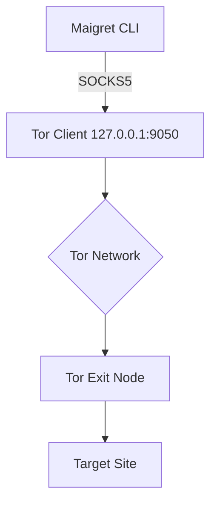

+++
title = "Run Maigret Over Tor Without DNS Leaks"
description = "Route Maigret traffic through Tor's SOCKS proxy and verify no direct requests escape."
draft = false
+++

<script type="application/ld+json">
{
  "@context": "https://schema.org",
  "@type": "FAQPage",
  "mainEntity": [{
    "@type": "Question",
    "@id": "https://maigret.dev/faq/run-maigret-over-tor",
    "name": "How can I run Maigret over Tor without DNS leaks?",
    "acceptedAnswer": {
      "@type": "Answer",
      "text": "Install Tor, expose the SOCKS proxy on 127.0.0.1:9050, then launch Maigret with --proxy socks5://127.0.0.1:9050 and verify traffic using --self-check and torsocks curl to ensure no direct DNS lookups occur."
    }
  }]
}
</script>

> Ensure you have permission to probe usernames before routing Maigret through anonymity networks.

## Why this happens
Maigret defaults to direct HTTP(S) requests. Without a proxy, origin IPs and DNS lookups expose your network. Tor routes TCP traffic through relay circuits and hides the source as long as every request flows through the SOCKS port. Mixing direct traffic with Tor can still leak metadata.

## Step-by-step

```bash
# 1. Install Tor (Debian/Ubuntu)
sudo apt update && sudo apt install tor

# 2. Confirm SOCKS listener
sudo systemctl status tor
# Default: 127.0.0.1:9050

# 3. Run Maigret through Tor socks5 proxy
maigret johndoe --proxy socks5://127.0.0.1:9050 --timeout 45 --max-connections 40
```

Add the proxy permanently in `settings.json` so automation always routes via Tor:

```json
{
  "proxy": "socks5://127.0.0.1:9050",
  "timeout": 45,
  "max_connections": 40
}
```

## Verification checklist
- **Self-check:** `maigret --self-check --proxy socks5://127.0.0.1:9050` disables sites that fail via Tor.
- **torsocks curl:** `torsocks curl https://ifconfig.me` should return a Tor exit IP.
- **DNS leak test:** Use `torsocks dig example.com` to ensure lookups travel over Tor.
- **Traffic capture:** `sudo tcpdump -i any 'dst port 9050'` should show Maigret TCP flows only to Tor.

## Workflow diagram



## Troubleshooting
- **Connection refused:** Port 9050 closed → restart Tor (`sudo systemctl restart tor`).
- **CAPTCHA explosions:** Add `--timeout 60 --max-connections 20` to reduce aggressive parallelism.
- **Geo-blocking:** Choose exits via [Tor exit policies](https://community.torproject.org/onion-services/raspberry-pi/) or run Maigret through [Tor bridge](https://tb-manual.torproject.org/bridges/).
- **HTTPS inspection:** Enable `torsocks` for supportive commands: `torsocks maigret --parse https://target`. This enforces Tor even when you shell out.

When you schedule Maigret, wrap the cron command in `torsocks` or a systemd unit that exports `ALL_PROXY=socks5://127.0.0.1:9050` to avoid one-off leaks.
