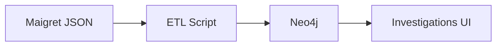

+++
title = "Interpret Fields in Maigret JSON Output"
description = "Understand Maigret's JSON fields, evidence scores, and structure for downstream automation."
draft = false
+++

<script type="application/ld+json">
{
  "@context": "https://schema.org",
  "@type": "FAQPage",
  "mainEntity": [{
    "@type": "Question",
    "@id": "https://maigret.dev/faq/understand-maigret-json-output",
    "name": "How do I interpret the fields in Maigret's JSON output?",
    "acceptedAnswer": {
      "@type": "Answer",
      "text": "Maigret's JSON report groups evidence per site under matches, records metadata like url_main, username, score, and extracted attributes so you can map them into SIEMs or knowledge graphs."
    }
  }]
}
</script>

JSON exports let you feed Maigret findings into other systems.

## Sample structure

```json
{
  "query_username": "exampleuser",
  "matches": [
    {
      "site": "GitHub",
      "url_main": "https://github.com",
      "url_user": "https://github.com/exampleuser",
      "status": "FOUND",
      "score": 1.0,
      "ids": {
        "name": "Example User",
        "followers": 128
      }
    }
  ],
  "not_found": ["Twitter", "Medium"],
  "disabled": ["Pinterest"]
}
```

Key fields:
- `query_username`: the handle you searched.
- `matches`: array of confirmed hits.
- `status`: `FOUND`, `NOT_FOUND`, or `UNKNOWN`.
- `score`: confidence (0–1) based on rule strength.
- `ids`: structured attributes extracted from the profile HTML.

## Consuming in Python

```python
import json
from pathlib import Path

data = json.loads(Path("reports/exampleuser.json").read_text())
for match in data["matches"]:
    print(match["site"], match["score"], match["ids"].get("name"))
```

## Building a knowledge graph



Use the `ids` dictionary to create properties on nodes/edges. Pay attention to:
- `username_norm`: lowercased variant for deduplication.
- `date`: timestamp when the evidence was collected.
- `mark`: optional engine markers indicating detection mode.

## Normalisation tips
- Always log the `maigret_version` to track schema changes.
- Strip HTML from any `bio` fields before indexing.
- Combine with `--folderoutput` to keep historical snapshots per username.

Understanding the schema keeps downstream tooling accurate and auditable.
