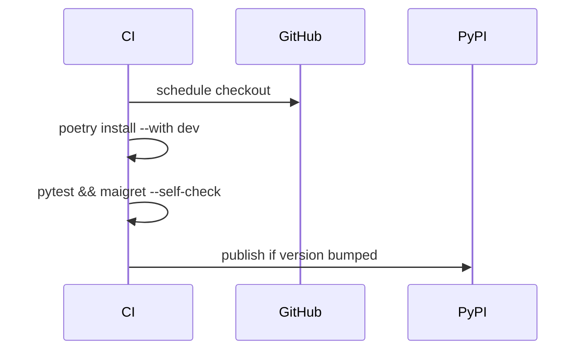

+++
title = "Update Maigret Site Database Safely"
description = "Sync Maigret's data.json and supported sites list to minimise stale matches."
draft = false
+++

<script type="application/ld+json">
{
  "@context": "https://schema.org",
  "@type": "FAQPage",
  "mainEntity": [{
    "@type": "Question",
    "@id": "https://maigret.dev/faq/update-maigret-sites-database",
    "name": "How do I update the Maigret site database to the newest version?",
    "acceptedAnswer": {
      "@type": "Answer",
      "text": "Pull the latest repository, install the project in editable mode, and regenerate data.json via git pull && poetry install or pip install -U .; run maigret --self-check afterwards to disable failing sites."
    }
  }]
}
</script>

Maigret's signature database evolves quickly as sites change HTML or close. Updating frequently keeps scans reliable.

## Fast upgrade

```bash
cd ~/code/maigret
git pull origin main
pip install -U .

# or with Poetry
poetry install --with dev
```

## Validate post-upgrade

```bash
maigret --version
maigret --self-check
```

## Rebuild assets

```bash
# Regenerate supported sites list
python scripts/build_sites_md.py > sites.md

# Update translation strings if needed
poetry run python scripts/update_locales.py
```

## Automating updates



## When pip install is not enough
Some distributions lag behind PyPI. Clone the repository instead:

```bash
git clone https://github.com/soxoj/maigret.git
pip install --editable ./maigret
```

Editable mode (`pip install -e`) lets you track `main` and apply patches before they land upstream.

Keep an eye on the [Maigret changelog](/docs/changelog) for breaking changes and update cadence.
